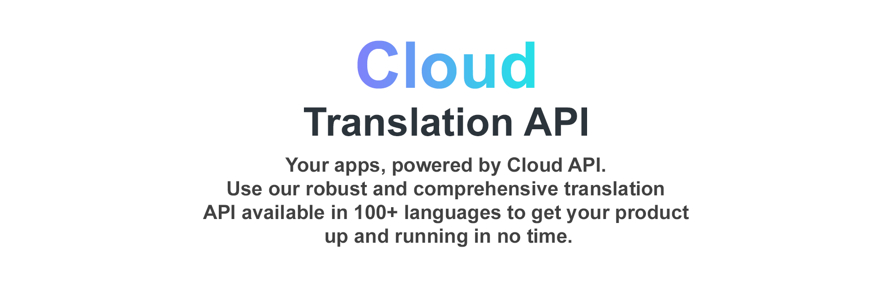

# CloudAPI.Stream
High-quality cloud service for text translation. 100+ Languages <a href="https://cloudapi.stream/" target="_blank">https://cloudapi.stream/</a>

<h2>Class initialization</h2>
<code>
  $CAS = new CAS;
</code>
<h2>Key installation</h2>

<code>
  $CAS->set_key('******-*****-*****-*****');
</code>

Visit to website <a href="https://cloudapi.stream/dev/sign-in" target="_blank">https://cloudapi.stream/dev/sign-in</a>

<iframe width="560" height="315" src="https://www.youtube.com/embed/YPSVJbHkQTc" title="YouTube video player" frameborder="0" allow="accelerometer; autoplay; clipboard-write; encrypted-media; gyroscope; picture-in-picture; web-share" allowfullscreen></iframe>

<h2>Get a list of languages available for translation</h2>
<code>
  $answer = $CAS->langs();
</code>
<h3>Answer</h3>

<code>
  array(3) {
  ["result"]=>
  bool(true)
  ["langs"]=>
  array(110) {
    ["af"]=>
    string(9) "Afrikaans"
    ["am"]=>
    string(7) "Amharic"
    ["ar"]=>
    string(6) "Arabic"
    ["auto"]=>
    string(15) "Detect Language"
    ["az"]=>
    string(11) "Azerbaijani"
    ["be"]=>...
  </code>

<h2>Text translation</h2>

<code>
  $answer = $CAS->translate('en','fr','Hi bro!');
</code>

<code>
  translate(FROM_LAGUAGE_CODE,TO_LAGUAGE_CODE,TEXT);
</code>

<h3>Answer</h3>

<code>
  array(3) {
  ["result"]=>
  bool(true)
  ["text"]=>
  string(15) "Salut mon pote!"
  ["times"]=>
  array(1) {
    ["total_time"]=>
    float(2.0059208869934)
  }
}
  </code>

